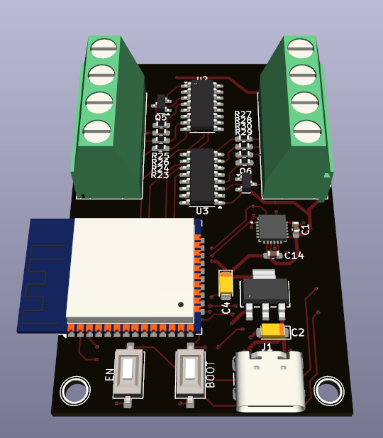
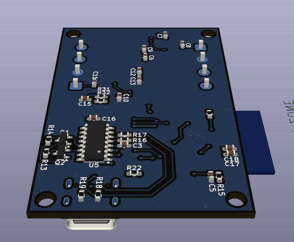
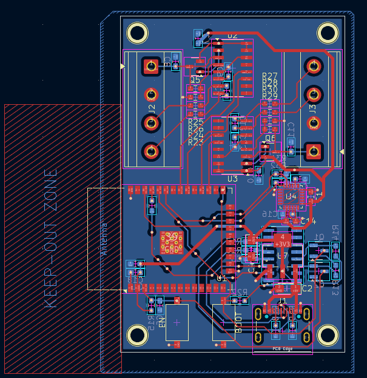

# 📘 PCB Review 

---

## 🖼️ PCB Images

### 🔵 Front View

  

---

### 🔴 Back View

  

---

### 🟢 Routing View

  

---

## 📄 Schematic

📥 Nhấn vào link bên dưới để xem sơ đồ nguyên lý:

👉 [Open Schematic PDF](image/Schematic.pdf)

---

## 📝 Notes
- Kích thước mạch: 60 x 40 (mm)
- Khoảng cách lỗ: 54 x 34 (mm)

---

## ✅ BOM
- [ ] SOC - ESP WROOM 32 (x1)
- [ ] IC - HX711 IC (x2)
- [ ] IC - CH340C (x1)
- [ ] IC - MPU6050 (x1)
- [ ] LDO - AMS1117 3V3 (x1)
- [ ] Transistor - SS8050 NPN (x2)
- [ ] Transistor - SS8550 PNP (x2)
- [ ] Button SMD - 3x6x2.5 (mm) (x2)
- [ ] Connector - TypeC 16P USB2.0 (x1)
- [ ] Connector - Terminal block 5.08 mm - 4 Pin (x2)
- [ ] Capacitor Tantalum - 3216 (Check schematic)
- [ ] Capacitor SMD - 0603 (Check schematic)
- [ ] Resistor SMD - 0603 (Check schematic)

---